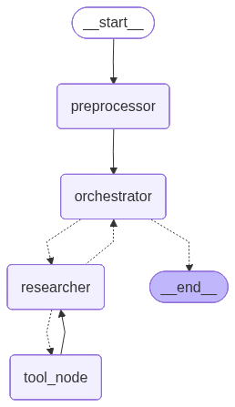

# AgentR 🤖

**Research Agent Using a Plan-and-Execute Architecture**

AgentR is a stateful research agent built with **LangGraph**.
Inspired by the **[Plan-and-Solve](https://arxiv.org/abs/2305.04091)** paper and the
**[BabyAGI](https://github.com/yoheinakajima/babyagi)** project, it dynamically plans,
executes, and refines research tasks through a flexible tool system.

## 🚀 Features

- **Intelligent Research Decision**: An orchestrator determines whether a query requires research
- **Multi-Step Planning**: Generates and refines execution plans iteratively
- **Dynamic Tool Selection**: Type-safe tools with runtime configuration
- **Iterative Research**: Multiple search cycles with quality control and source tracking
- **Observability**: Integrated Langfuse tracing and monitoring
- **Modular Design**: Extensible node- and tool-based architecture

## 🏗️ Architecture

AgentR follows a **Plan-and-Execute** workflow:
1. Generate a multi-step research plan
2. Execute each step using appropriate tools
3. Re-evaluate and adapt the plan as new information is gathered

This workflow is implemented as a stateful, graph-based system using LangGraph.


### Computational Graph


### Core Components

1. **AgentR Graph (`src/graph/agent.py`)**: Main stateful graph built with LangGraph
2. **Nodes**:
   - **Preprocessor**: Processes user queries into message history
   - **Orchestrator**: Decides if research is needed and synthesizes results
   - **Researcher**: Conducts iterative web research with dynamic tool access
   - **Tool Node**: Executes tools requested by the researcher
4. **Tool System (`src/tools/`)**: Registry pattern with extensible base tools
5. **LLM Client (`src/client/`)**: OpenAI-compatible client wrapper

## 📦 Installation

### Prerequisites
- Python 3.12 or higher
- [Poetry](https://python-poetry.org/docs/#installation) for dependency management
- API keys for:
  - OpenAI/DeepSeek (required)
  - Tavily (recommended for web search)
  - Langfuse (optional for observability)

## 🚀 Quick Start

### 1. Installation
```bash
# Clone the repository
git clone <repository-url>
cd AgentR

# Install dependencies with Poetry
poetry install

# Set up environment variables
cp .env.dev.example .env.dev
# Edit .env.dev with your API keys
```

### 2. Environment Configuration
Edit `.env.dev` with your API keys:
```bash
API_KEY=your_openai_or_deepseek_api_key
API_URL=https://api.deepseek.com  # or OpenAI endpoint
MODEL_NAME=deepseek-chat  # or gpt-4, gpt-3.5-turbo

TAVILY_API_KEY=your_tavily_api_key  # for web search

# Optional: Langfuse for observability
LANGFUSE_BASE_URL=http://localhost:3000/
LANGFUSE_SECRET_KEY=your_langfuse_secret_key
LANGFUSE_PUBLIC_KEY=your_langfuse_public_key
```

### 3. Usage
Run the agent via the CLI:

```bash
# Basic query without tracing
poetry run python app/app.py "Your research query" false

# With Langfuse tracing enabled
poetry run python app/app.py "Your research query" true
```

**Examples:**
```bash
# Simple factual question (answered directly)
poetry run python app/app.py "What is LangGraph?" false

# Research-intensive query (triggers web search)
poetry run python app/app.py "Latest developments in quantum computing 2025" false

# With observability tracing
poetry run python app/app.py "Climate change impact on agriculture" true
```

### 4. How It Works
1. **Query Analysis**: The orchestrator determines if research is needed
2. **Planning**: If research is required, creates a multi-step research plan
3. **Execution**: Researcher conducts iterative web searches using Tavily
4. **Synthesis**: Findings are compiled into a coherent response
5. **Observability**: Optional Langfuse tracing provides execution insights

**CLI Arguments:**
- `query` (required): Your research question or topic
- `tracing` (required): Enable/disable Langfuse tracing (`true`/`false`)

> **Note**: The `tracing` argument accepts boolean values: `true`, `false`, `1`, `0`, `yes`, `no` (case-insensitive).

## 🔧 Troubleshooting

### Common Issues

**1. API Key Errors**
- Ensure your API keys are correctly set in `.env.dev`
- For DeepSeek/OpenAI: Verify `API_KEY`, `API_URL`, and `MODEL_NAME`
- For Tavily: Get a free API key from [tavily.com](https://tavily.com)

**2. Module Import Errors**
```bash
# If you see "ModuleNotFoundError", ensure you're using poetry:
poetry run python app/app.py "your query" false

# Or activate the virtual environment first:
poetry shell
python app/app.py "your query" false
```

**3. Research Query Failures**
- If research queries fail, check your Tavily API key
- Simple factual queries should work without Tavily
- Test with: `poetry run python app/app.py "What is LangGraph?" false`

**4. Langfuse Tracing**
- To use tracing, ensure Langfuse is running locally or update `LANGFUSE_BASE_URL`
- Set `tracing=true` to enable: `poetry run python app/app.py "query" true`

**5. Timeout Issues**
- Complex research queries may take longer
- The agent has a default max iteration limit of 4 research cycles

## 🧪 Testing

Test the agent with different query types:

```bash
# Direct answer (no research needed)
poetry run python app/app.py "Explain the Plan-and-Execute architecture" false

# Research query (requires Tavily API key)
poetry run python app/app.py "Recent breakthroughs in AI alignment 2025" false

# With observability
poetry run python app/app.py "Impact of renewable energy on climate change" true
```

## 📚 Development

For development setup, see the source code documentation in each module.